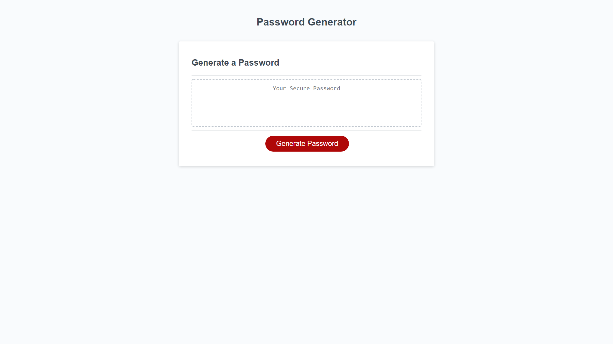

# Password Generator

This project is about creating a code for a premade template in order to create a working password generator. The goal is to be able to allow the user to select from an assortment of dialog boxes to generate a strong password fitting what answers were given.

## About the Project

[Password Generator](https://pldbrja.github.io/password-gener8tor/)

The HTML and CSS in this project was premade in order to focus on just the Javascript coding that was desired. The user story requested that the generator be able to create strong passwords fitting the criteria that the user (employee) inputs into the dialog that appears at the top of the browser. 

Upon answering any of the confirm boxes with a "cancel" button, it will return a small alert dialog before redirecting to the next question.

## Screenshots

